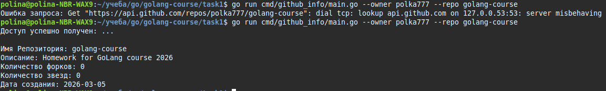

# Домашнее задание №1  
## CLI-инструмент для получения информации о репозитории GitHub

---

## Задача

Необходимо реализовать простой CLI-инструмент на Go, который получает информацию о репозитории GitHub и выводит её в консоль.

Инструмент должен:

- принимать параметры репозитория (способ передачи --- на ваше усмотрение),
- отправлять HTTP-запрос к GitHub,
- получать JSON-ответ,
- выводить ключевую информацию в читаемом виде.

Репозиторий должен быть обязательно оформлен (хотя бы минимальный README с инструкцией к запуску).

---

## Минимальная информация, которую необходимо вывести

1. Имя репозитория  
2. Описание  
3. Количество звёзд  
4. Количество форков  
5. Дата создания  

---

## Требования

- Использовать только стандартную библиотеку Go.
- Для сетевых запросов использовать `net/http`.
- Выводить информацию в читаемом виде.
- Обработать возможные ошибки:
  - отсутствие репозитория,
  - сетевые ошибки,
  - некорректный ввод.
---

## Формат сдачи задания

Необходимо добавить ревьюеров в collaborators репозитория: `Settings -> Collaborators -> Add people`
Ревьюеры:
- https://github.com/suvorovrain
- https://github.com/Dabzelos
- https://github.com/vacmannnn

Работу над заданием необходимо вести в отдельной ветке.

В конце работы необходимо открыть PR из вашей ветки в main вашего форка и отметить ревьюеров в разделе `Reviewers`.

В PR с выполненным заданием необходимо приложить скриншот работы приложения :).

Рекоммендуется писать адекватное описание коммитов и PR.


## Полезные материалы

- Крутая книга для изучения GoLang: Jon Bodner --- Learning Go
- Необходимая документация API GitHub для выполнения задания: https://docs.github.com/en/rest/repos

## Итог

- 
- вывод программы при положительном исходе и при неудачном запросе(с выключенным интернетом)
- для запуска из корня:
```
- go run cmd/github_info/main.go --owner polka777 --repo golang-course
```
- где нужно задать флаги owner и repo своими значениями
